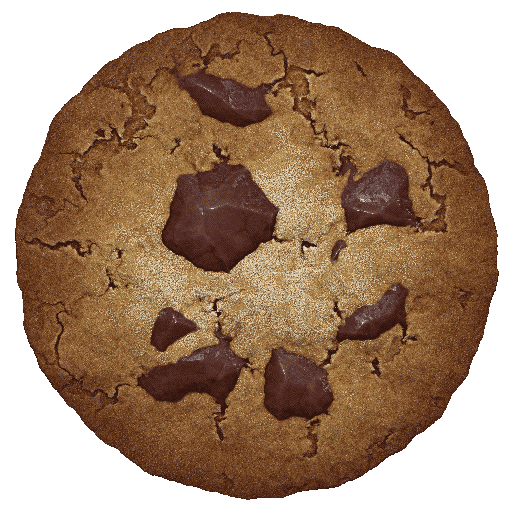

<html lang="en">
<head>
    <meta charset="UTF-8">
    <meta name="viewport" content="width=device-width, initial-scale=1.0">
    <title>Cookie Clicker</title>
    
</head>
<body>
    <h1>Fancy Cookie Clicker</h1>
    

        <!-- Cookie Section -->
        

            
            <audio id="click-sound" src="../sound/sound1.mp3"></audio>
        

        <!-- Display Cookies and Cookies per Second -->
        
Cookies: 0

        
Cookies per second: 0

        <!-- Shop Section -->
        

            <!-- Granny Purchase -->
            <button id="buy-granny">
                
                Buy Granny (Cost: 100 cookies)
            </button>
            
Grannies: 0 (each makes 1 cookie per second)

            <!-- Factory Purchase -->
            <button id="buy-factory">
                
                Buy Factory (Cost: 500 cookies)
            </button>
            
Factories: 0 (each makes 5 cookies per second)

            <!-- Plane Purchase -->
            <button id="buy-plane">
                
                Buy Plane (Cost: 2000 cookies)
            </button>
            
Planes: 0 (each makes 10 cookies per second)

            <!-- Worldwide Factory Purchase -->
            <button id="buy-worldwide-factory">
                
                Buy Worldwide Factory Network (Cost: 100,000 cookies)
            </button>
            
Worldwide Factories: 0 (each makes 300 cookies per second)

        

        <!-- Milestone Messages -->
        

        <!-- Save/Load Game Section -->
        

            <button id="save-game">Save Game</button>
            <button id="load-game">Load Game</button>
            <input type="text" id="save-code" placeholder="Paste your save code here">
        

    

    
</body>
</html>
